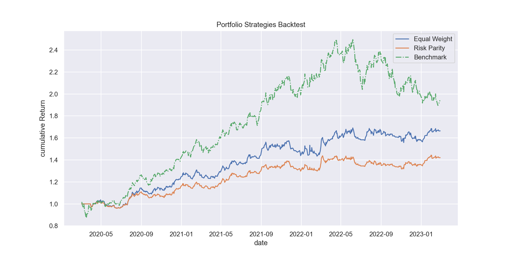
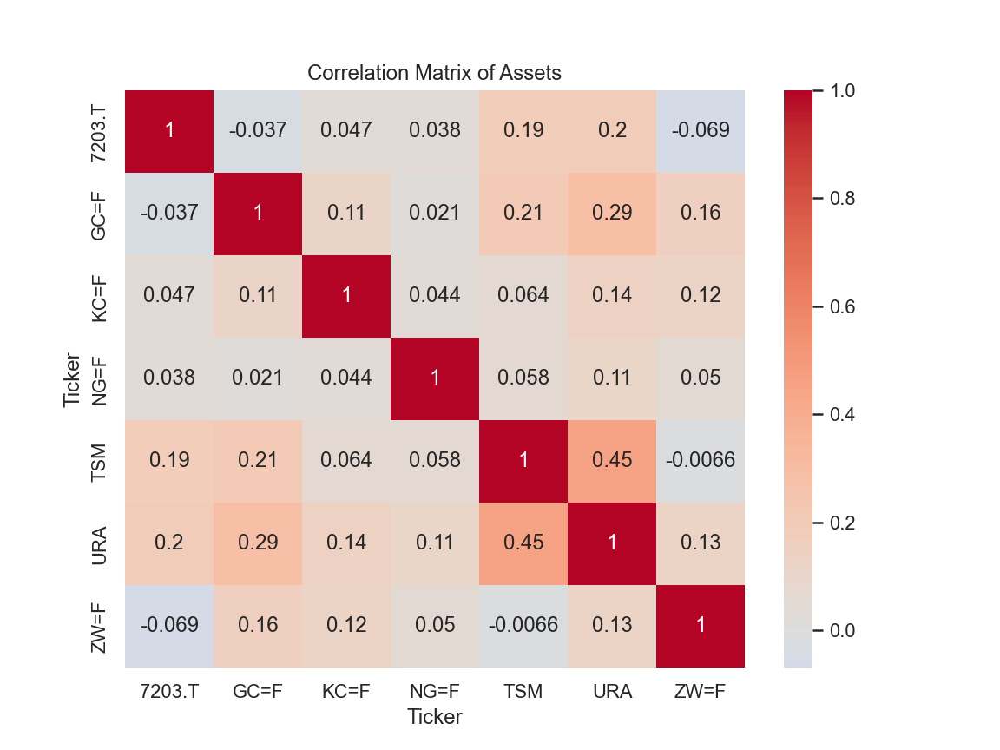

# Quantitative Portfolio Backtesting

This project implements a backtesting framework in Python to evaluate different portfolio allocation strategies on Asian stocks and commodities.  
The analysis includes **Equal Weight**, **Risk Parity**, and a **Buy & Hold benchmark**, with performance metrics such as CAGR, volatility, Sharpe ratio, Sortino ratio along with  maximum drawdown to analyse risk management.

---

##  Features
- Data collection using `yfinance`
- Portfolio backtesting engine
- Performance metrics:
  - CAGR (Compound Annual Growth Rate)
  - Volatility
  - Sharpe Ratio
  - Sortino Ratio
  - Maximum Drawdown
- Visualization:
  - Cumulative performance curves
  - Drawdown chart
  - Correlation heatmap of assets
- Comparison between asset classes (Commodities vs Asian Equities)

---

## 📊 Results (2020–2023)
- **Equal Weight Strategy**: CAGR ~ 19.92%, Sharpe ~ 1,37
- **Risk Parity Strategy**: CAGR ~ 13.34%, Sharpe ~ 1,20


Commodities achieved better risk-adjusted performance compared to Asian equities, with higher Sharpe/Sortino ratios and more robust CAGR.
This highlights the importance of asset class diversification in portfolio management.

--------------------------

## 🔍 Insights
- **Commodities** benefited from macroeconomic cycles and inflationary pressures, resulting in stronger Sharpe and Sortino ratios.  
- **Asian equities( Tsmc,Toyota)** underperformed, partly due to higher volatility and slower recovery post-pandemic.  
- Diversification across asset classes improves portfolio resilience.

##




---
##
Author 
Developped by *[Thomas.R]* as a personal initiative project to explore portfolio management.
## 🛠️ Installation
Clone the repository and install dependencies:

```bash
git clone https://github.com/<your-username>/<repo-name>.git
cd <repo-name>

pip install -r requirements.txt

